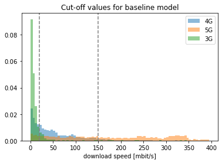
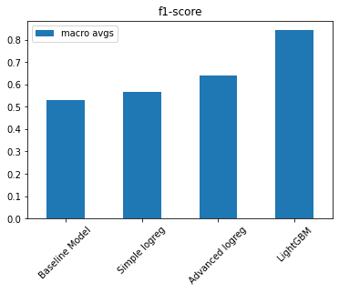
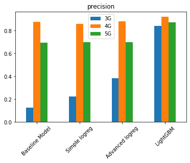

# speedtest-classification
Exploring multiclass classification with LightGBM and sklearn custom transformation pipelines on internet speedtest data.  

## Aim
The dataset contains information such as down- & upload speed, ping, signal strength, a timestamp of when the test was conducted, the network name,, location of the device, and technology.
It is gathered by an internet speedtest tool and publicly available.
Aim of this toy-project is to use the metrics recorded during the test to classify whether it was made via a 3G, 4G, or 5G connection.  

## Learnings
### _Simple baseline first_ 

Before building any machine learning model, it is sensible to start with a simple baseline. 
This will give you a benchmark that your more complex models have to beat to be truly useful.
For this project I looked at the distribution of download speeds in mbit/s and manually set threshold values to differentiate between the three categories.

I set the upper threshold value for 3G at 20 mbit/s and for 4G at 150 mbit/s.
According to this baseline model, any measurement with a download speed below 20 mbit/s is classified as 3G, speeds between 20 and 150 mbit/s are classified as 4G, and anything beyond 150 mbit/s is classified 5G.  
See `notebooks/02-baseline.ipynb` & `src/models/baseline.py` for the implementation.

### _Use transform pipelines for feature generation_  

Inspired the Transform Design Pattern described in the book [Machine Learning Design Patterns](https://www.oreilly.com/library/view/machine-learning-design/9781098115777/) by Lakshmanan et al., I included all feature preparation into modular transformations that are part of the model pipeline.
This approach offers several advantages compared with manually tranforming the dataset before feeding it into the model:
* It eliminates the need to copy & paste the transformation logic between training and prediction workflow, thus reducing the risk for train/serving skew.
* There is a clear separation between input values and features. As a consequence, the input values remain interpretable (e.g., not yet scaled, categories are not yet one-hot-encoded).
* Transformation hyperparameters can be optimised during model training along with model hyperparameters. For example, I built a custom `OutlierRemover` class, that caps numeric values above a certain threshold. Where exactly this threshold should be set is determined by automated hyperparameter tuning.  
See `notebooks/03-preprocessing.ipynb` and `src/utils/transform.py` for details.  

### _LightGBM is awesome_
In this project I compared the baseline model explained above, a simple logistic regression model with only few input features, a more advanced logistic regression with more features and LightGBM.
Whereas the two logistic regression variants only slightly outperformed the baseline model, LightGBM achieved considerably better results without much additional tinkering.

## How to run locally
    make environment
will create a conda environment with the packages listed in `environment.yaml`.  

    make raw_data
will load the dataset from the web.

    make input_data
will select relevant instances and inputs for further modelling / feature generation.

    make tests
will run the tests.  

## Model training and evaluation
is handelled in `notebooks/05-training.ipynb`

---

<small>Project based on the <a target="_blank" href="https://drivendata.github.io/cookiecutter-data-science/">cookiecutter data science project template</a>. #cookiecutterdatascience</small>

